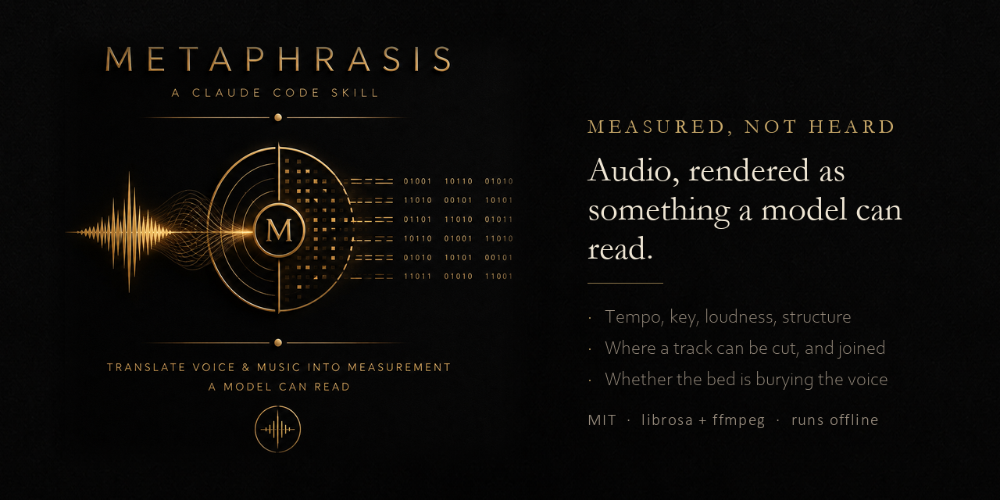

# Metaphrasis

**Read audio you cannot hear.**

An Agent Skill for Claude Code, Codex, Cursor, and other Agent-Skills-compatible tools.

---

## The gap this fills

A coding agent has no ears. Ask it to pick background music for a video, or to check whether a narrated cut is any good, and it will do one of two things: refuse, or guess in fluent prose.

Guessing is the worse failure. `D minor, low spectral centroid, slow` really does often sound melancholic, so a confident description will be right often enough to earn trust, then fail on the case that mattered.

Metaphrasis takes the third path. Named for the word-for-word half of Dryden's distinction, it translates audio across a medium boundary without interpreting it: measurement in, measurement out, and an explicit refusal to tell you how anything sounds.

| Approach | What it gives an agent |
|---|---|
| Refuse | Nothing |
| Describe the vibe | Fluent, unfalsifiable, occasionally wrong in the way that costs a re-edit |
| **Measure** | **Tempo, key, LUFS, structure, cut points, and a number for "will this bury the voice"** |

## What it does

```bash
metaphrasis scan   <dir>                  # one line per track, a whole library at a glance
metaphrasis read   <file>                 # strip chart plus ranked cut points
metaphrasis pick   <dir> --for voiceover  # shortlist for a job
metaphrasis matrix <dir>                  # which tracks join cleanly with which
metaphrasis splice <spec.json>            # cut across tracks, sew into one piece
metaphrasis narration <video>             # transcript, pacing, dead air, and the mix
```

A scan line:

```
the-verdict-03   2:59    -    C  -12.9 poor ▁▃▃▃▄▅▅▇▇▆▇▅▆▇▇▅▅▃▅▇▇▇▇▇███▃▂▃▆▇▆▆▂ dark smooth narrow
```

Length, tempo, key, perceptual loudness, a voiceover verdict, the energy shape as a sparkline, and timbre in plain words. A dash under BPM means there is no real pulse, which matters more than it looks.

## The metronome trap

Beat trackers always return a tempo. On a sustained pad they return one they invented, and cutting picture to it makes a video twitch against nothing.

Testing whether the beats landed on onsets does **not** catch this, because the tracker places beats on envelope peaks by construction. That test was built first and it scored the most static pad in the library as the most rhythmic.

What separates them is the shape of the onset envelope. A groove produces many similar peaks, so the distribution is broad and kurtosis is low. A pad is flat with occasional swells, which is the textbook heavy-tailed shape. The threshold was calibrated on 42 tracks of known intent, with a clean gap between 11.0 and 13.1 and nothing in between.

## Narration

`narration <video>` transcribes the voiceover and measures it against the music underneath.

The mix number is deliberately computed from the audio's speech-band energy and **never from the transcript**. An earlier version sampled the bed from the gaps between transcript segments; adding a vocabulary prompt changed the segmentation, erased those gaps, and swung the verdict from "clear" to "buried" on a video that was fine. A number that moves when the transcriber's settings move is measuring the transcriber.

## Requirements

`ffmpeg` and `ffprobe` on PATH, and Python with `librosa`, `numpy`, `scipy`, `soundfile`.

Narration additionally needs a Whisper build. The bundled `tools/WhisperCli` is a small C# host over Whisper.net that runs fully offline; build it once with `dotnet build -c Release`.

## What it cannot do

- **Hear.** No aesthetic judgement, no artifact detection, no catching that a track sounds cheap.
- **Lyrics reliably.** Whisper is trained on speech and degrades on sung vocals over music.
- **Replace listening.** It turns forty-two candidates into eight. You listen to the eight.

Every claim this skill makes is a measurement you can check. That is the entire design.

## Install

```
/plugin marketplace add Pr1m4lc0d3/metaphrasis
/plugin install metaphrasis
```

Or copy `skills/metaphrasis/` into your `.claude/skills/` folder.

## Related

- **[paraphrasis](https://github.com/Pr1m4lc0d3/paraphrasis)** — the mirror. This one crosses a medium literally; that one crosses an audience faithfully.
- **[peitho](https://github.com/Pr1m4lc0d3/peitho)** — for the script, once the transcript exists.
- **[janus](https://github.com/Pr1m4lc0d3/janus)** — positioning before copy.

## License

MIT. See [LICENSE](LICENSE).
